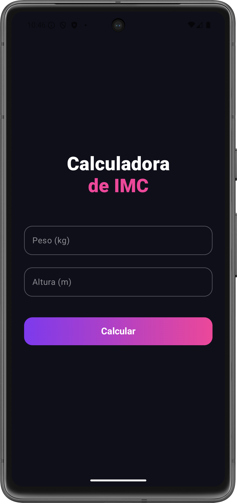
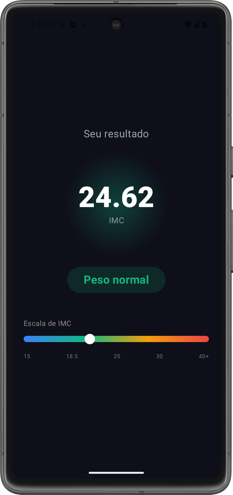

# IMC Calculator

A BMI calculator built with Jetpack Compose. Two screens, smooth transitions, and a color-coded scale that animates to your result.

## Screenshots

<p float="left">
  
  
</p>

## Stack

- Kotlin
- Jetpack Compose
- Navigation Compose
- `animateFloatAsState` for the BMI scale animation

## Structure

```
ui/
  screens/
    FormScreen.kt
    ResultScreen.kt
  navigation/
    AppNavigation.kt
MainActivity.kt
```

## BMI ranges

| Range | Classification |
|---|---|
| Below 18.5 | Underweight |
| 18.5 – 24.9 | Normal weight |
| 25.0 – 29.9 | Overweight |
| 30.0+ | Obese |

## Running

Clone the repo and open in Android Studio. Requires API 26+.

---

[LinkedIn](https://linkedin.com/in/raniel-schneider-79006b50) · [GitHub](https://github.com/ranielschneider)
